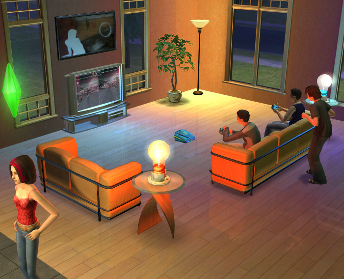
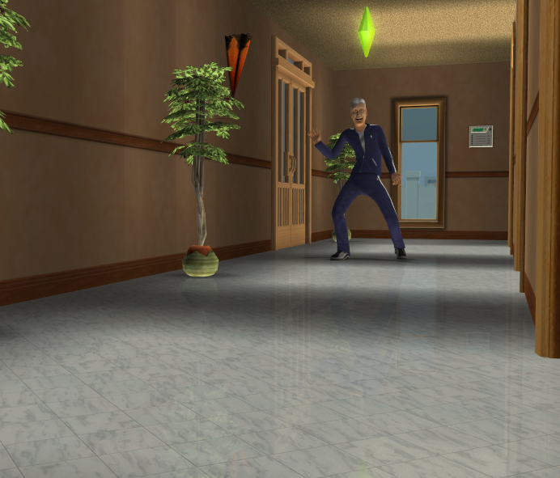

# TS2 Beta Floors
A patch for The Sims 2 that attempts to restore the unused reflective floor functionality seen in prerelease media, but that was cut from the final game.

Made for use with The Sims 2: Ultimate Collection, using either [Sims2RPC](https://modthesims.info/d/648220/sims2rpc-modded-sims-2-launcher-for-mansion-and-garden.html)
or [Ultimate ASI Loader](https://github.com/ThirteenAG/Ultimate-ASI-Loader).


| Prerelease | Mod |
| :--------: | :-: |
|  |  |


## Adding Reflections to Custom Floors
The reflective floor shader has been assigned to a number of vanilla floors out of the box. If you wish to make certain custom floors reflective (or
other vanilla floors not included by default), it is as simple as adding the desired floor to the bottom of the shader code in the provided `.package` file,
following the template below:

```
materialDefinition floor_txmt_name
   setDefinition FloorReflective
   addParam stdMatLayer 2
   addParam stdMatBaseTextureName floor_txtr_name
   addParam reflectStrength 0.1 // I recommended using a small value for the reflection strength
end
```

## Known Issues
- The floor reflection system doesn't support multiple reflection planes, so all floor reflections are drawn from the same point.
This introduces an issue where if a reflective floor is present on both the ground floor and second floor of a house, the reflections on the
second floor will be drawn as if they were at the ground floor. To work around this, I've made it so the reflection plane shifts up/down when switching
the game camera between floors of the house. A side effect of this is that the reflections on lower floors will also be shifted upwards and get cut
off, but this is only noticeable if reflective floors are placed outside.

- Because the reflection plane is a flat surface, reflections may be inaccurate if a reflective floor tile is placed directly on sloped/uneven terrain.

- Reflective floors use the same render type as mirrors, so mirrors may flicker between what the mirror is reflecting and what a floor is reflecting
depending on the camera angle. This is an engine limitation and can't be fixed.

- Mirrors on the floor below a reflective floor will be visible in the floor's reflection &mdash; this may be related to the render type sharing issue
outlined above.

- Mirrors visible in floor reflections may flash red.

## Installation
### Plugin
**For Sims2RPC**

1. Download the zip file found under the [Releases](https://github.com/spockthewok/TS2ReflectiveWater/releases/latest) section of this repository.
2. Extract the `.asi` plugin within the zip file to the `\TSBin\mods` directory, found under wherever you have the Sims 2 installed to. For example, on my machine,
the plugin would be moved to:

   `E:\Games\The Sims 2\Fun with Pets\SP9\TSBin\mods`

**For Ultimate ASI Loader**

1. Download Ultimate ASI Loader from [here](https://github.com/ThirteenAG/Ultimate-ASI-Loader/releases/download/Win32-latest/dsound-Win32.zip).
2. Extract `dsound.dll` from the zip file and place it in the game's `\TSBin` directory. On my machine, it would go here:

   `E:\Games\The Sims 2\Fun with Pets\SP9\TSBin`
3. Download the zip file found under the [Releases](https://github.com/spockthewok/TS2ReflectiveWater/releases/latest) section of this repository.
4. Extract the `.asi` plugin within the zip file to the same `\TSBin` directory Ultimate ASI Loader was extracted to.

### Shaders
1. Download the zip file found under the [Releases](https://github.com/spockthewok/TS2ReflectiveWater/releases/latest) section of this repository.

2. Extract the `.package` file within the zip file to your Sims 2 `\Downloads` directory.

## Thanks
[LazyDuchess](https://github.com/LazyDuchess), for the hooking code used in this mod.

[Dorsal Axe](https://modthesims.info/m/6990975), for the beta material shaders shared [here](https://modthesims.info/t/608894).