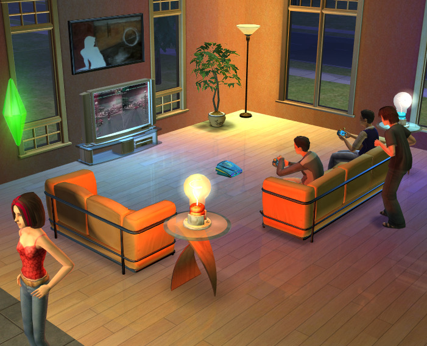
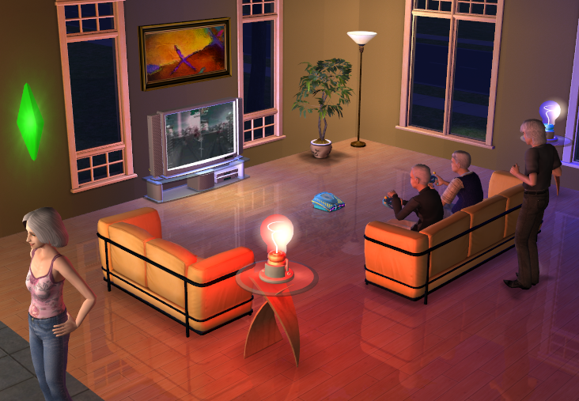

# TS2 Beta Floors
A patch for The Sims 2 that attempts to restore the unused reflective floor functionality seen in prerelease media, but that was cut from the final game.

| Prerelease | Mod |
| :--------: | :-: |
|  |  |

## Requirements
- The Sims 2: Ultimate Collection <ins>**OR**</ins> The Sims 2 disc version with all EPs and SPs.
- [Sims2RPC](https://modthesims.info/d/648220/sims2rpc-modded-sims-2-launcher-for-mansion-and-garden.html) <ins>**OR**</ins>
[Ultimate ASI Loader](https://github.com/ThirteenAG/Ultimate-ASI-Loader).

## Adding Reflections to Custom Floors
The reflective floor material shader has been assigned to a number of vanilla floors out of the box. If you wish to make certain custom floors reflective (or
other vanilla floors not included by default), it is as simple as adding the desired floor to the bottom of the floor shader code in the provided `.package` file,
following the template below:

```
materialDefinition floor_txmt_name
   setDefinition FloorReflective
   addParam stdMatBaseTextureName floor_txtr_name
   addParam reflectStrength 0.1 # I recommend using a small value for the reflection strength
   ### These should be set using the values from the floor's TXMT:
   addParam stdMatLayer floor_txmt_value
   addParam floorMaterialScaleU floor_txmt_value
   addParam floorMaterialScaleV floor_txmt_value
   addParam stdMatDiffCoef (floor_txmt_values)
end
```

> [!WARNING]
> Custom floors with `#` characters in their TXMT/TXTR names won't work, as these denote comments in the game's shader code and will therefore be ignored
> during parsing.

## Known Issues
- The game doesn't support/can't handle a single class having multiple viewer nodes, so despite each level of a house having its own separate
reflection camera, only one will be used at a time.

   This introduces an issue where if a reflective floor is present on both the ground level and second level of a house, the reflections for the
   floor on the second level will be drawn as if it was at the ground level &mdash; to work around this, I've made it so only the level currently being
   viewed will have its reflection camera attached. A side effect of this is that the reflections for lower levels will be shifted upwards to the height
   of the current level and get cut off, but this is only noticeable if reflective floors are placed outside.

   In fact, this engine limitation is visible with any reflective surface that can be placed at varying elevations and relies on a viewer node for its
   reflections. For example, swimming pools on elevated terrain will reflect what pools at the ground level are seeing, and the same problem also occurs
   with the pond water in Castaway Stories.

- The height of each camera's reflection plane is calculated using the elevation of the floor tile at the centre of the lot, presumably because this
is where houses are commonly built. This is fine in most circumstances, but if a lot has particularly uneven terrain, or has multiple buildings
of differing elevations, reflections can become inaccurate.

- Likewise, the game has no concept of basements (the lowest level it considers is level 0, the ground floor), so the reflections for any
reflective floors placed below ground level will be drawn from the base height of the lot's terrain.

- Mirrors on the levels below a reflective floor will be visible in the floor's reflection, due to the stenciling method mirrors use to mark out and
project their reflections.

## Installation
### <ins>Plugin</ins>
**Sims2RPC Users:**

1. Download the zip file found under the [Releases](https://github.com/spockthewok/TS2BetaFloors/releases/latest) section of this repository.
2. Extract the `.asi` plugin within the zip file to the `\TSBin\mods` directory, found under wherever you have the Sims 2 installed to. For example, on my machine,
the plugin would be moved to:

   `E:\Games\The Sims 2\Fun with Pets\SP9\TSBin\mods`

**Ultimate ASI Loader Users:**

1. Download Ultimate ASI Loader from [here](https://github.com/ThirteenAG/Ultimate-ASI-Loader/releases/download/Win32-latest/dsound-Win32.zip).
2. Extract `dsound.dll` from the zip file and place it in the game's `\TSBin` directory. On my machine, it would go here:

   `E:\Games\The Sims 2\Fun with Pets\SP9\TSBin`
3. Download the zip file found under the [Releases](https://github.com/spockthewok/TS2BetaFloors/releases/latest) section of this repository.
4. Extract the `.asi` plugin within the zip file to the same `\TSBin` directory Ultimate ASI Loader was extracted to.

### <ins>Shaders</ins>
1. Download the zip file found under the [Releases](https://github.com/spockthewok/TS2BetaFloors/releases/latest) section of this repository.

2. Extract the `.package` file within the zip file to your Sims 2 `\Downloads` directory.

3. If you're using the mod [Build/Buy Grid Follows Cursor](https://modthesims.info/d/696189/build-buy-grid-follows-cursor.html), you should also download
`CompatibilityPatches.zip` and extract the `.package` file within to your `\Downloads` directory too. This is a replacement for the default
`zzz_Beta_Floors.package`, so you should allow your operating system to overwrite the original file if prompted.

## Thanks
[LazyDuchess](https://github.com/LazyDuchess), for the hooking code used in this mod.

[Dorsal Axe](https://modthesims.info/m/6990975), for the beta material shaders shared [here](https://modthesims.info/t/608894).

[CroconawSims](https://modthesims.info/m/10269790), for their mod [Build/Buy Grid Follows Cursor](https://modthesims.info/d/696189/build-buy-grid-follows-cursor.html).